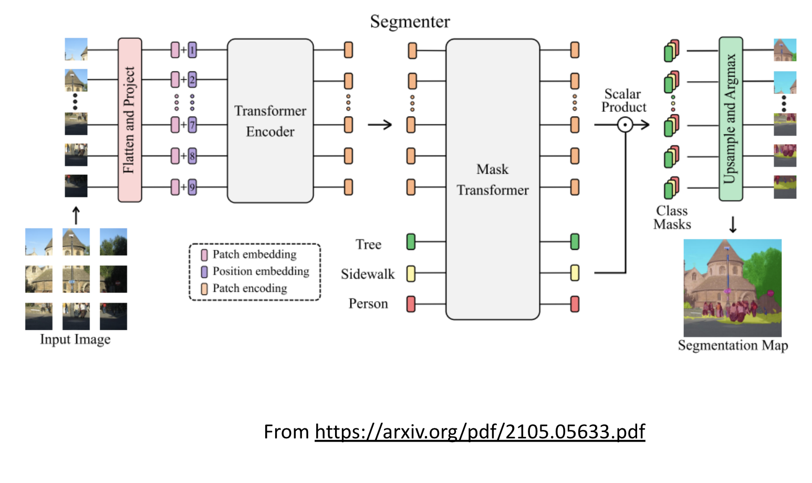
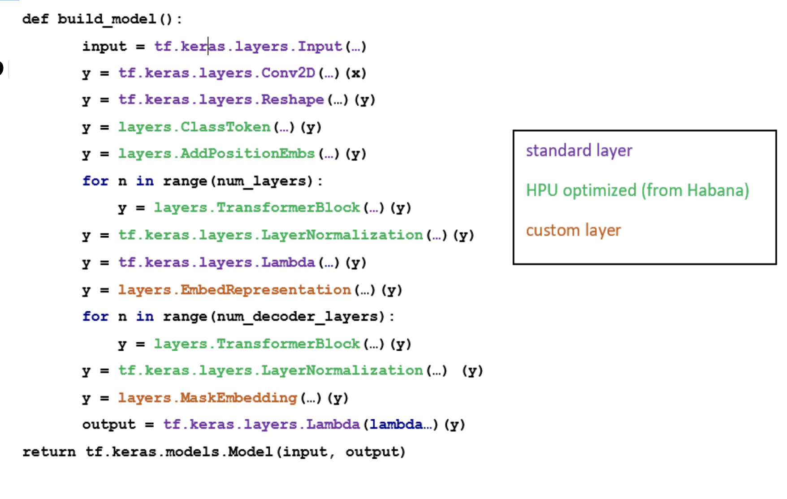
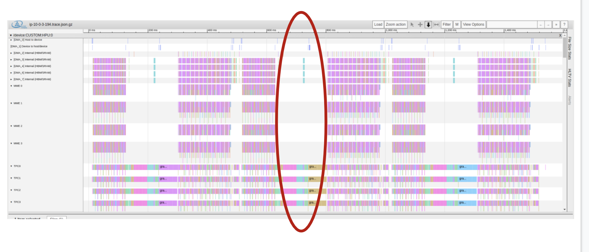
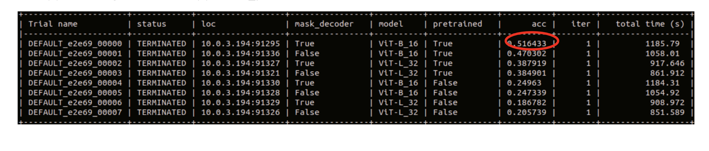
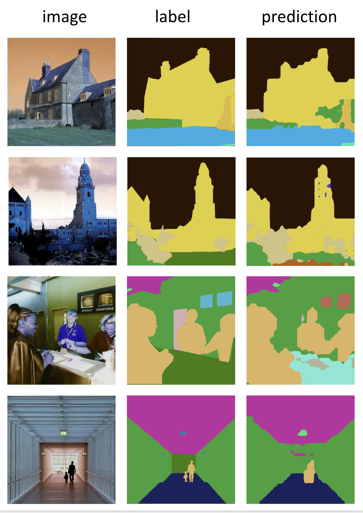

# Transformer Based Semantic Segmentation for Habana Gaudi

## Table of contents

- [Projection Description](#project-description)
- [Setup](#setup)
- [Building the Model](#building-the-model)
- [The Dataset](#the-dataset)
- [Parameter Search with RayTune](#parameter-search-with-raytune)
- [Distributed Training with Horovod](#distributed-training-with-horovod)
- [Results](#price-performance-evaluation)
- [Usage](#usage)
- [Contents](#contents)

## Project Description
In this project I implemented a semantic segmentation model with vision transformers for Amazon EC2 DL1 using RayTune and Horovod.


### Potential Value and Creativity
- Demonstration how to use RayTune for Gaudi for parallel hyper-parameter optimization 
- Demonstration of Horovod on Gaudi
- Implementation of Vision Transforms based semantic segmentation on Gaudi 
- Demonstration of Gaudi cost benefits
- Demonstration of usage of Habana model reference building blocks


## Project Goals
- Implement a semantic segmentation model in TensorFlow for DL1 which is powered by Gaudi (HPU) accelerators.
- Use the vision transformer block as a backbone. Attention based transformers originated in the world of NLP, in the paper:
  [Attention is All You Need](https://arxiv.org/pdf/1706.03762.pdf).
  The use of tranformers for vision tasks was introduced in the paper [An Image is Worth 16x16 Words: Transformes For Image Recognition at Scale](https://arxiv.org/pdf/2010.11929.pdf).
- Transformer models are large networks that can be difficult to train. To address this it is common to employ methods of transfer
  learning to accelerate convergence. For example, you can take weights that were trained for object classification and reuse them
  as pretrained weights in a semantic segmentation model. Here I use weights from [a transfomer based imagenet classificaton model](https://github.com/faustomorales/vit-keras/releases).
- Demonstrate the steps for building/porting a model for Gaudi.
- Demonstrate parallelized hyperparameter tuning on Gaudi processors using RayTune. [RayTune](https://docs.ray.io/en/ray-0.4.0/tune.html)
  is a popular framework for hyperparameter tuning. While it does not officially support HPU accelerators, it can be adapted to
  run on Gaudi as I demonstrate. By using parallel hyperparameter tuning one can discover the best combination of parameters for training.
- Demonstrate distributed training on Gaudi processors using the Habana [Horovod](https://horovod.readthedocs.io/en/stable/index.html) framework.
- Compare price performance of training Segmentor model on dl1 (Habana Gaudi) instance compared to p4 (NVidia A100)


### Architecture
I chose to adopt the model architecture that appears in the paper [Segmenter: Transformer for Semantic Segmentation](https://arxiv.org/pdf/2105.05633.pdf).
This paper proposes an encoder-decoder architecture for segmentation, where the encoder is based on the paper
[Attention is All You Need](https://arxiv.org/pdf/1706.03762.pdf). The decoder which is either linear or tranformer based, scales the
encoder output features back up to the input resolution, outputting a per-pixel segmentation map.

A pytorch reference for this model was published [here](https://github.com/rstrudel/segmenter).


## Setup
In this section I describe the steps required to setup and run the training script.
The [Habana installation guide](https://docs.habana.ai/en/latest/Installation_Guide/GAUDI_Installation_Guide.html) includes many options for platform setup.
1. I chose to instantiate an ec2 instance with the latest [Habana® Deep Learning Base AMI (Ubuntu 18.04)](https://aws.amazon.com/marketplace/pp/prodview-msrpidkcut7d6) from the AWS marketplace.
2. I followed the instructions [here](https://docs.aws.amazon.com/AWSEC2/latest/UserGuide/add-instance-store-volumes.html#making-instance-stores-available-on-your-instances
) to mount a storage volume and update the docker daemon to use this mount (as documented [here](https://docs.docker.com/engine/reference/commandline/dockerd/). Note that this step is missing from the official documentation.
3. I used the latest relevant docker image vault.habana.ai/gaudi-docker/1.3.0/ubuntu18.04/habanalabs/tensorflow-installer-tf-cpu-2.8.0:1.3.0-499
4. Once inside the container:
   - install the aws cli to enable connection to Amazon s3
   ```bash
   pip3 install awscli
   ```
   - configure the the aws cli
    ```bash
   aws configure ...
   ```
   - pull the project code into your work directory
   - update to PYTHONPATH to point to your work directory
   ```bash
   export PYTHONPATH=$PYTHONPATH:<workdir>
   ```
   - install dependencies
   ```bash
   pip3 install -r requirements.txt
   ```
5. To run on a single HPU run the following command:
```bash
python3 segmenter/train.py --dataset s3://<path to tfrecords>
```
The data will be downloaded to ~/.keras and training will commence.

## Building the Model
Here I describe the steps I took to build the model for HPU.
1. I used building blocks from HabanaAI Model-Reference. These are tuned for optimal performance on HPU.
In particular the VisionTransformer reference model includes tranformer building blocks which I reused in segmenter/layers.py.
Additionally I used the utilities for loading pretrained weights (segmenter/utils.py).
The code block below (from segmenter/vit.py) demonstrates the degree to which specialized building blocks were used:



2. Performance Profiling
Habana includes a performance profiler for analyzing performance.
To profile HPU training on a single HPU, run:
```bash
python3 segmenter/train.py --dataset s3://<path to data> --outdir s3://<output path> --profile
```
The profiling trace is uploaded to s3 for analysis in [https://hltv.habana.ai](https://hltv.habana.ai)
The image below is an example of a captured trace view, that demonstrates the potential for further
optimization through load balancing.



3. I took advantage of the HPUs bfloat16 support which further accelerated performance.

## The Dataset
I chose the dataset published by the [MIT Scene Parsing Challenge](http://sceneparsing.csail.mit.edu/)
which is based on the [ADE20K](http://groups.csail.mit.edu/vision/datasets/ADE20K/) dataset.
The dataset includes 20,210 training samples and 2,000 validation samples with their associated segmentation maps.
The dataset includes 150 semantic categories including sky, road, grass, person, car, bed, and more.
The segmenter/create_tfrecords.py script downloads the dataset and converts it to TFRecord files which I stored in s3,
and downloaded onto DL1 for training.
The segmenter/ADE20K.py includes the tf.data dataset creation functions. These include standard augmentations for the
training input pipeline.


## Parameter Search with RayTune
[RayTune](https://docs.ray.io/en/ray-0.4.0/tune.html) is a popular framework for hyperparameter tuning.
In particular, it enables parallelizing experiments over multiple accelerators. RayTune can be adapted to run on HPU,
by 1) setting the num_gpus to 8 in ray.init() and 2) copying the value of the CUDA_VISIBLE_DEVICES environment variable
to HABANA_VISIBLE_DEVICES at the start of each process. See the segmenter.train.py script for more details.
Using RayTune enables experimenting with different training hyperparameters such as the optimizer, the learning rate,
the type of decoder block, bfloat16, etc.
In the example below we have programmed 8 parallel experiments that will train with and without pretrained weights (transfer learning),
with 2 different vision transformer encoder backbones, and two different decoder architectures (linear and transformer based).
```bash
config={
     "pretrained": tune.grid_search([True, False]),
     "model": tune.grid_search(['ViT-B_16', 'ViT-L_32']),
     "mask_decoder": tune.grid_search([True, False])}
```
To run hytperparameter tuning:
```bash
python3 segmenter/train.py --dataset s3://<path to data> --outdir s3://<path to output> --tune_params
```
Below are RayTune results showing that the best options are to use ViT-B_16 with pre-trained weights and a transformer based decoder.




## Distributed Training with Horovod
Once the optimal hyperparameters were chosen, the training can be distributed across all 8 cores.
Habana supports several ways for distributing training. I chose to use the Horovod option to increase
multi-platform portability.
To train on all 8 cores using Horovod, with a ViT-B16 encoder backbone, pretrained encoder weights, a tranformer based decoder, and mixed precision:
```bash
horovodrun -np 8 -H localhost:8 python3 segmenter/train.py --dataset s3://gaudi/tfrecords --outdir s3://gaudi/output --pretrained --mask_decoder -d bf16 --model ViT-B_16
```

## Results
After training for roughly 5 hours we received the following results:

|  | Sparse Categorical Accuracy | Mean IOU |
| ------- | ----- | ----- |
| Train | 84.7% | 54.6% |
| Test | 78.4% | 40.3% |
| SOTA | ~80% | ~50% |

Despite being below SOTA these are very good results, especially for training for 5 hours.




## Price Performance Comparison
We ran the same the training on AWS Nvidia V100 instances. We found that running the training on Gaudi was 46% cheaper than the same training on eight Nvidia V100 instances.
This is a VERY significant price performance benefit! 


## Usage
The training script includes the following controls:
- `dataset`: The path to the training data.
- `dtype`, `d`: Data type (fp32 or bf16).
- `batch_size`: Global batch size.
- `initial_lr`: Initial learning rate for lr scheduler.
- `final_lr`: Final learning rate for lr scheduler.
- `epochs`: Total number of epochs for training.
- `steps_per_epoch`: Number of steps for training per epoch, overrides default value.
- `validation_steps`: Number of steps for validation, overrides default value.
- `model`: The encoder architecture (ViT-B_16, ViT-L_16, ViT-B_32, ViT-L_32).
- `resume_from_checkpoint_path`: Path to checkpoint to start from.
- `resume_from_epoch`: Initial epoch index.
- `evaluate_checkpoint_path`: Checkpoint path for evaluating the model on validation data
- `predict_checkpoint_path`: Checkpoint path for predicting the model on validation data
- `tune_params`: Run hyper parameter tuning on a programmed search space
- `profile`: Profile HPU
- `mask_decoder`: Use transformer for decoder (default is linear decoder)
- `pretrained`: Use pretrained encoder weights
- `outdir`: output path

### Examples

| Command | Notes |
| ------- | ----- |
|python3 segmenter/train.py --dataset s3://<path to data> --outdir s3://<out> --profile | Profile single-card training in fp32, store trace to s3 |
|python3 segmenter/train.py --dataset s3://<path to data> --tune_params | Run parallel experiments on all 8 cards |
|horovodrun -np 8 python3 segmenter/train.py --dataset s3://<path to data> -d bf16 --pretrained --mask_decoder | transfer learning on 8-cards in bf16 with mask_decoder|
|python3 segmenter/train.py --dataset s3://<path to data> --predict_checkpoint_path s3://<path to ckpt> --outdir s3://<out>| Predict using given ckpt, store results to s3 |
|python3 segmenter/train.py --dataset s3://<path to data>  --mask_decoder --evaluate_checkpoint_path s3://<path to ckpt> | Evaluate given ckpt |

## Contents
- `requirements.txt`: pip installation dependencies
- `ckpt/ViT-B_16-pretrained-maskdecoder-model-final.h5`: Trained segmenter model
- `segmenter/create_tfrecords.py`: script for converting ADE20K dataset to tfrecord files
- `segmenter/ADE20K.py`: builds an returns an augmented tf.data dataset
- `segmenter/layers.py`: includes the model building blocks (extended from Habana reference)
- `segmenter/utils.py`: utilities for loading pretrained weights (from Habana reference)
- `segmenter/vit.py`: functions for building the tf.keras model (extended from Habana reference)
- `segmenter/train.py`: training script entry point

## References
- https://docs.habana.ai/en/latest/Installation_Guide/GAUDI_Installation_Guide.html
- https://docs.habana.ai/en/latest/Tensorflow_User_Guide/Tensorflow_User_Guide.html
- https://docs.habana.ai/en/latest/Tensorflow_Scaling_Guide/TensorFlow_Gaudi_Scaling_Guide.html
- https://docs.habana.ai/en/latest/Profiler_Guide/Profiler_User_Guide.html
- https://github.com/HabanaAI/Model-References/tree/master/TensorFlow/computer_vision/VisionTransformer
- https://github.com/HabanaAI/pyhlml
- https://arxiv.org/pdf/2105.05633
- https://github.com/rstrudel/segmenter
- https://docs.ray.io/en/releases-0.8.2/tune-examples.html
- https://horovod.readthedocs.io/en/stable/index.html
- http://sceneparsing.csail.mit.edu
- https://towardsdatascience.com/training-on-aws-with-habana-gaudi-3126e183048
- https://docs.aws.amazon.com/AWSEC2/latest/UserGuide/add-instance-store-volumes.html#making-instance-stores-available-on-your-instances
- https://github.com/faustomorales/vit-keras/releases
